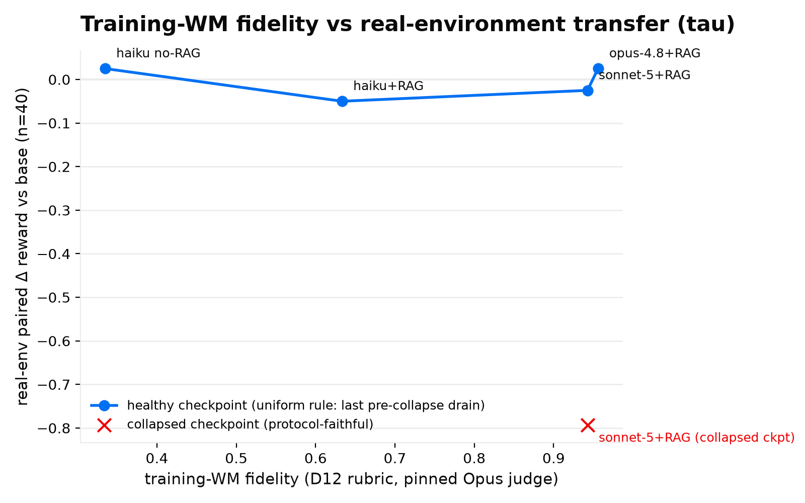

# Training-WM fidelity vs real-environment transfer (tau)

**Question.** When a policy is RL-trained closed-loop against a world model, does the WM's
reconstruction fidelity determine how well the trained policy transfers to the *real*
environment?

**Setup.** One REINFORCE++ n=4 group-baseline smoke (1 epoch × the 58-scenario informative
curriculum, same seed and scenario order, identical env substrate (the nominal temp-0
pin is inert on Bedrock-Anthropic request paths; identical across cells either way,
so cross-cell comparability holds), reward judge pinned to
Haiku 4.5) per training-WM backend; the resulting checkpoint (uniform rule: the last
pre-collapse drain) is evaluated on the **real tau2 benchmark** (real gym, real LLM
user-simulator, real grader) over the 20 pinned held-out tasks × 2 trials, paired
per-episode against the base model (90.0% success). X = each backend's D12 reconstruction
fidelity (rubric judge pinned to Opus 4.8, sampled-5 turns, 1319 held-out steps).

| training-WM backend | fidelity | smoke outcome | real-env paired Δ |
|---|---|---|---|
| Haiku 4.5, no RAG | 0.335 | healthy full epoch | +0.025 |
| Haiku 4.5 + RAG | 0.633 | healthy full epoch | −0.050 |
| Sonnet 5 + RAG | 0.943 | collapsed ~ep 90 (2× replicated) | −0.025 (pre-collapse drain) |
| Opus 4.8 + RAG | 0.956 | collapsed ~ep 90 | +0.025 (pre-collapse drain) |
| Sonnet 5, collapsed ckpt | 0.943 | post-collapse | **−0.793** |

**Findings** (curve-shape claims; n=1 run/point, n=40 episodes/row):

1. **Healthy-checkpoint transfer is flat within noise across a 3× fidelity range.** A
   0.335-fidelity WM trained the policy as well as a 0.956 one at smoke scale against a
   90% real-env base ceiling. Fidelity spend is not where the training leverage is at
   this scale.
2. **Fidelity is not free: higher-fidelity environments destabilize training at fixed
   hyperparameters.** Both high-fidelity backends collapsed into a no-tool-call policy at
   ~episode 90 (three independent replications) under the exact settings where both
   low-fidelity backends ran healthy full epochs: harsher grading produces denser
   negative advantages, shrinking the collapse step-budget below one epoch. The
   collapsed-checkpoint row (−0.793) shows the cliff is total. Practical rule: drain
   checkpoints early and select the last pre-collapse drain.

**Reproduction.** Raw inputs are committed: fidelity cells in
`.agents/docs/research/tau_fidelity_cells/` (produced by
`uv run wmh eval run tau-bench --judge-model us.anthropic.claude-opus-4-8 --sample-turns
sampled --seed 0 --prompt <artifact optimized.txt> [--no-rag | --model <backend>]`) and
real-env episode records in `.agents/docs/research/real_tau_eval_results/` (produced by
`packages/environment-capture/tau-bench/rl/tau_real_eval.py` against a vLLM-served
checkpoint). The figure renders with
`uv run python .agents/scripts/plot_fidelity_transfer.py --out
docs/research/fidelity_transfer_curve.png`; the paired-Δ computation is inside that
script (mean per-episode reward delta over the paired intersection with the base row).
Full program context: `.agents/docs/research/bench_b2_results.md` and PR #73.
