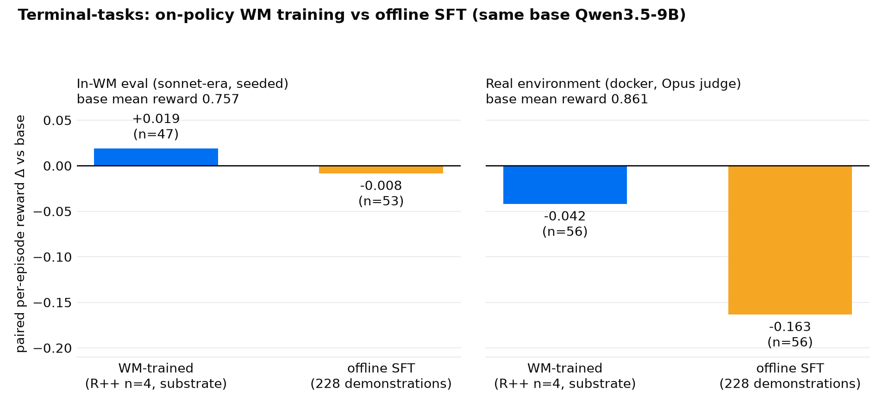

# Terminal-tasks head-to-head: on-policy WM training vs offline SFT

**Question (the BENCH-B2 scoreboard question).** Does on-policy training data made with the
world model beat offline SFT on demonstrations, for the same base policy on the same
benchmark?

**Setup.** Same base Qwen3.5-9B, two training recipes, two evaluation channels:

- **WM-trained**: REINFORCE++ n=4 group-baseline against the terminal world model on the
  D62/D65/D66 reward substrate (seeded case facts pinning the imagined world; the nominal
  temp-0 env pin was later found inert on the Bedrock-Anthropic request path; seeding is
  the operative variance fix), 412 episodes, checkpoint = last pre-decline drain
  (`drain-0075`).
- **Offline SFT**: LoRA on 228 recorded demonstration episodes from the terminal corpus
  (D26 leakage rule: any train trace whose task appears in the pinned eval set is dropped).
- **In-WM channel**: seeded sonnet-era WM eval (Bedrock Sonnet 5 env + Opus 4.8 judge)
  over the 28 pinned eval scenarios × 2 rollouts.
- **Real channel**: `packages/environment-capture/terminal-tasks/rl/terminal_real_eval.py`:
  a real docker container per episode, Opus 4.8 judge, same pinned scenarios.

Both arms are paired per-episode against the *same* base row within each channel; eras and
channels never compare in absolutes (base = 0.757 mean reward in-WM seeded, 0.861 real).

| arm | in-WM paired Δ | real-env paired Δ |
|---|---|---|
| WM-trained (R++ n=4, substrate) | +0.019 (n=47) | −0.042 (n=56) |
| offline SFT (228 demonstrations) | −0.008 (n=53) | **−0.163** (n=56) |

**Finding.** On-policy WM training did not damage deployment behavior; offline SFT did.
Both arms land at or below base on the real environment, so the honest claim is
harm-avoidance, not a win: the WM-trained arm stays within noise of base (−0.042, 7W/9L),
while offline SFT degrades real performance sharply (−0.163, 3W/30L: the
demonstration-style transplant failing on the 9B at temperature 1.0). The paired gap
between the two recipes is **+0.121** in favor of WM training. The in-WM channel ranks the
two arms the same way (+0.019 vs −0.008): the sonnet-era seeded WM eval predicted the
real-env ordering.

**Significance caveat (applies to every row of this size).** With n≈50 paired episodes and
most episodes tied, individual deltas of a few points are formally not significant; the
load-bearing comparisons are the *paired* W/L asymmetries (SFT real: 3W/30L is decisive;
WM-trained real: 7W/9L is noise-compatible) and the cross-arm gap, not any single delta's
sign.

**Reproduction.** Raw episode records are committed: WM-side rows in
`.agents/docs/research/sonnet_era_wm_rows/` (`wm_sonnet_term_base_seeded.jsonl`,
`wm_sonnet_term_sub_0075.jsonl`, `wm_sonnet_term_sft.jsonl`) and real-env rows in
`.agents/docs/research/real_terminal_eval_results/` (`real_terminal2_base.jsonl`,
`real_terminal_termsub.jsonl`, `real_terminal_termsft.jsonl`). The figure renders with
`uv run python .agents/scripts/plot_terminal_headtohead.py --out
docs/research/terminal_headtohead.png`; the paired-Δ computation is inside that script
(mean per-episode reward delta over the paired intersection of clean records with the
base row). Full program context: PR #73's status board.
